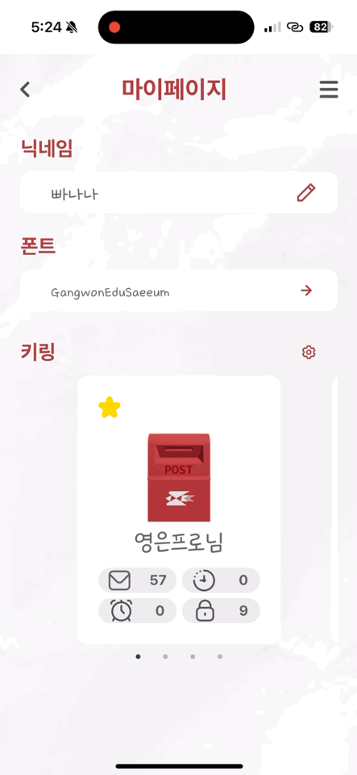
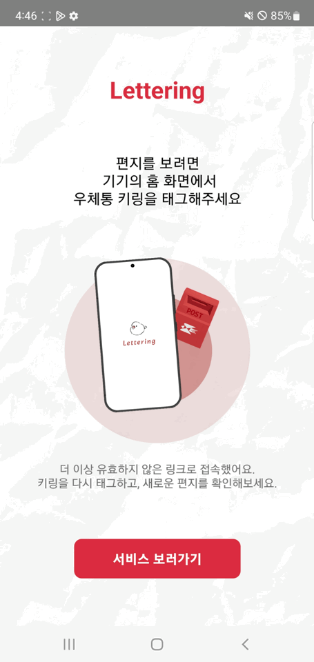
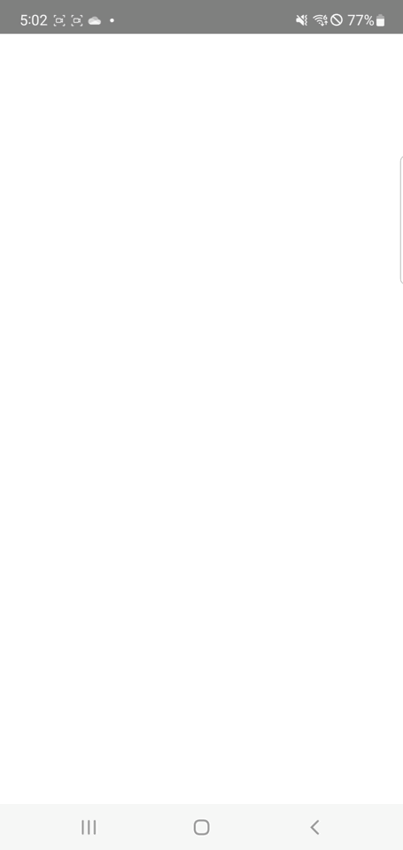
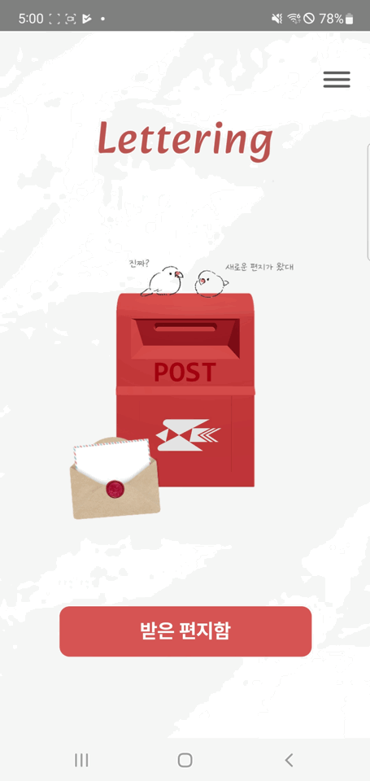

  <h1> Lettering 
  </h1>

> 배포 링크   > **https://letterring.shop/**

[장표표지.pdf](%EC%9E%A5%ED%91%9C%ED%91%9C%EC%A7%80.pdf)

> 배포 링크
>
> [**https://letterring.shop/**](https://letterring.shop/)

[figma](https://www.figma.com/design/MfCRRB3bWLgo4YMorH7M4U/%EC%A1%B8%EC%9E%91_%EB%94%94%EC%9E%90%EC%9D%B8?node-id=438-1940&t=iFzQIb6C351DL0Wr-0)   |

## **📄 목차**

- [📝 프로젝트 개요](#📝-프로젝트-개요)
- [💡 핵심 기능](#💡-핵심-기능)
  - [편지 전송 유형 선택 기능](#편지-전송-유형-선택-기능)
  - [AI 글쓰기 어시스턴스](#ai-글쓰기-어시스턴스)
  - [엽서 다운로드 기능](#엽서-다운로드-기능)
- [🖼️ 주요 화면](#🖼️-주요-화면)
- [🛠️ 기술 스택](#🛠️-기술-스택)
- [🖇️ 시스템 구조도](#🖇️-시스템-구조도)
- [🔎 FE 기술적 도전](#🔎-fe-기술적-도전)
  - [이미지 확장자 및 용량 제한](#📁-이미지-확장자-및-용량-제한)
  - [동적 UI 구성](#🎨-동적-ui-구성)
  - [다양한 편지 템플릿 선택](#💌-다양한-편지-템플릿-선택)
  - [엽서 다운로드 기능](#🖼️-엽서-다운로드-기능)
  - [Dear 사용자용 React Native 앱 배포](#📱-dear-사용자용-react-native-앱-배포)
- [🔎 BE 기술적 도전](#🔎-be-기술적-도전)
  - [NFC 키링 인증 시스템 고도화](#1️⃣-nfc-키링-인증-시스템-고도화)
  - [편지 내용 암호화](#2️⃣-편지-내용-암호화)
  - [AI 글쓰기 어시스턴스](#3️⃣-ai-글쓰기-어시스턴스)
- [🧑🏻‍💻 팀원 소개](#팀원-소개)

---

## 📝 프로젝트 개요

**Lettering**은 나의 마음과 추억을 ‘NFC 키링’에 담아 선물하고,
사진과 메시지를 지속적으로 기록 및 공유할 수 있는 감성적인 편지 서비스입니다.

사용자는 편지 유형을 선택하고, 사진을 첨부해 글을 작성하며, AI의 도움으로 글의 품질을 향상시킬 수 있습니다.
작성한 편지는 NFC 키링에 연동되어 특정 사람만 확인할 수 있도록 보안 처리됩니다.

---

## 💡 핵심 기능

### ✉️ 편지 전송 유형 선택 기능

- **일반 편지** : 즉시 전송
- **비밀 편지** : 퀴즈를 풀어야 확인 가능
- **예약 편지** : 특정 날짜와 시간에 자동 전송
- **오픈 타이머 편지** : 타이머 종료 후 확인 가능

### 🤖 AI 글쓰기 어시스턴트

- GPT 기반 AI가 문맥을 분석하여 편지 구성 보조
- 이미지 기반 문장 보강 기능 제공 (예: 사진 속 배경을 설명하는 문장 추가)

### 📩 엽서 다운로드 기능

- 받은 엽서를 **이미지**형태로 다운로드 가능
- 사용자가 받은 엽서를 추억으로 간직할 수 있도록 이미지 저장 기능 제공

---

## 🖼️ 주요 화면

### ✉️ 보내는 사람(Sender)

**온보딩 - 서비스 소개 및 로그인**  

**마이페이지 - 닉네임, 폰트 설정, 키링 목록 확인**  

**키링구매 - 키링 디자인 선택 및 결제 진행**  

**편지 디자인 선택**  

**편지 작성 - 이미지 업로드 및 내용 입력**  

**AI 어시스턴스**  

**받는 사람 설정**  

**편지 상세 - 편지 템플릿 동적 UI**  

### 📮 받는 사람(Dear)

**노태그 대기 화면**  

**새로운 편지 도착 시 랜딩**  

**새로운 편지 없을 때 랜딩**  

**비밀편지 열람**  

**키링 영구 삭제 확인 화면**  

---

## 🛠️ 기술 스택

| 구분            | 사용 기술                                           |
| --------------- | --------------------------------------------------- |
| 💻 개발 도구    | VSCode, Git, GitHub, Figma, Postman, Notion         |
| 🧑‍💻 언어         | Java, JavaScript, Python                            |
| 🗃️ 데이터베이스 | MariaDB, Redis                                      |
| 🧩 프레임워크   | Spring Boot (BE), React + Recoil (FE), FastAPI (AI) |
| 🤖 AI           | OpenAI GPT API, FastAPI, Python                     |
| 🚀 배포         | AWS EC2, S3, Nginx, Docker, Jenkins                 |
| 🤝 협업 도구    | GitHub, Notion, Figma, Jira                         |

---

## 🖇️ 시스템 구조도

---

## 🔎 FE 기술적 도전

### 📁 이미지 확장자 및 용량 제한

- .jpg, .png, .heic 파일만 업로드 가능 제한
- JavaScript `File` 객체로 확장자/용량 확인 처리
- 업로드 시 `browser-image-compression`을 사용해 1MB 이하로 압축
- 압축 전후 미리보기 이미지 갱신 처리 포함

### 🎨 동적 UI 구성

- 편지 유형에 따라 UI 애니메이션이 실시간 반응
- 상태 관리는 Recoil을 사용하여 전체 앱과 연결

### 💌 다양한 편지 템플릿 선택

- 편지지는 여러 디자인 템플릿 중 선택 가능
- 템플릿은 react-slick 기반의 캐러셀로 구성

### 🖼️ 엽서 다운로드 기능

- 모달 내 렌더링된 DOM을 `html2canvas`로 캡처하여 이미지화
- `file-saver`를 이용해 PNG 저장 기능 구현
- React Native 앱 환경은 WebView에서 캡처된 base64 이미지를 `postMessage`로 전달하고, 앱 내부에서 이미지 파일로 저장

### 📱 Dear 사용자용 React Native 앱 배포

- 편지를 받는 사람은 React Native 기반의 Android 앱(apk)으로 편지를 확인
- NFC 태깅을 통해 편지 열람 가능하도록 구현
- apk 단독 실행이나 키링 태깅만으로는 열람 불가능
- 전용 다운로드 안내 페이지 제공으로 사용자 거부감 최소화

---

## 🔎 BE 기술적 도전

### 1️⃣ NFC 키링 인증 시스템 고도화

> 태깅 시마다 동적으로 생성되는 token + mac을 통해 사용자가 실제 태깅한 주체임을 인증하고, 1회용 sessionToken 발급을 통해 메시지 접근을 제어하는 보안 시스템을 구축했습니다.

- **랜덤 토큰 기반 인증 흐름**: NFC 태깅 시 서버에서 token + mac 생성 후 검증 게이트웨이로 유도
- **복사/재사용 방지**: token은 TTL과 IP/UA를 통해 1회용 처리
- **보안 알고리즘**: CMAC 대신 HMAC-SHA256을 활용해 서버 환경에서 구현 가능하도록 설계

### 2️⃣ 편지 내용 암호화

> 서버에 저장되는 편지 본문 데이터는 AES 기반 대칭키 암호화를 적용해, 데이터 유출 시에도 메시지 내용을 확인할 수 없도록 처리했습니다.

- **AES 암호화 적용**: 편지 작성 시 암호화 → 복호화는 인증된 사용자만 수행 가능
- **DTO/Service Layer 분리 처리**: 암호화 및 복호화 로직은 비즈니스 로직과 분리하여 모듈화

### 3️⃣ AI 글쓰기 어시스턴스

> 사용자가 작성한 편지 내용을 AI가 자연스럽게 다듬고 이미지와 문맥을 분석해 감성적인 메시지로 변환하는 기능을 구현했습니다.

- **GPT 기반 API 연동**: 사용자의 초안을 OpenAI API에 전달해 감정 보완 및 자연어 개선
- **FastAPI 서버 구성**: AI 서비스는 Python + FastAPI로 구성되어 독립된 인프라에서 운영
- **이미지 기반 힌트 생성**: 첨부된 사진의 메타데이터나 키워드를 기반으로 스토리텔링 보조
- **반응형 적용**: AI 보정 내용은 편지 레이아웃에 적용되어 사용자가 미리 확인 가능

---

## 👩🏻‍💻 팀원 소개

---

| 김지수                                     | 강승엽                                       | 공예슬                         | 유하람                                   | 이하나                                   | 이효승                                           |
| ------------------------------------------ | -------------------------------------------- | ------------------------------ | ---------------------------------------- | ---------------------------------------- | ------------------------------------------------ |
| BE                                         | BE                                           | BE+AI                          | FE                                       | FE+INFRA                                 | FE                                               |
| [@jisu-0305](https://github.com/jisu-0305) | [@SeungYeopp](https://github.com/SeungYeopp) | [@Oys](https://github.com/0ys) | [@Ryuharam](https://github.com/Ryuharam) | [@ehanadul](https://github.com/ehanadul) | [@hyoseung2000](https://github.com/hyoseung2000) |
